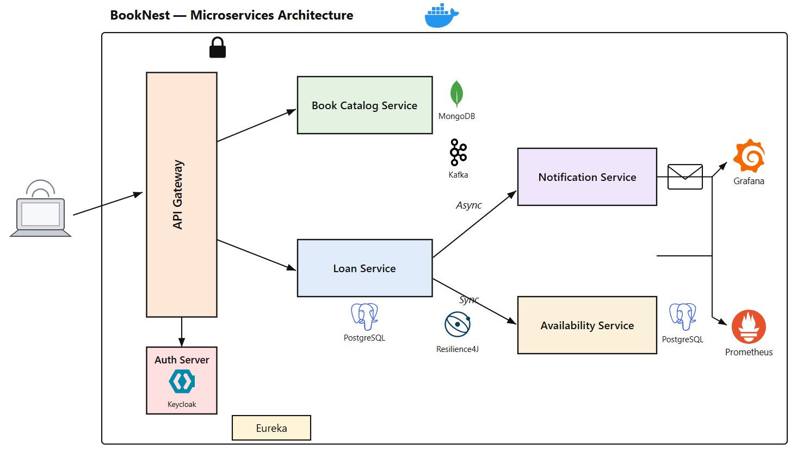

# BookNest

A microservices-based **Library Management** backend built with Spring Boot and Spring Cloud.

Members browse a book catalog, borrow books (create a loan), the system checks copy availability, and a
confirmation / due-date reminder is dispatched asynchronously.

## Architecture

## Tech Stack

- Java 17, Spring Boot 3.5.5, Spring Cloud 2025.0.0
- Maven multi-module build
- MongoDB (catalog), PostgreSQL (loan, availability)
- Apache Kafka (async messaging)
- Keycloak (OAuth2 / OIDC security)
- Resilience4j (circuit breaker, retry, time limiter)
- Micrometer + Prometheus + Grafana (observability)
- Docker / Docker Compose / Jib

## Modules

| Module                 | Description                                | Port  |
| ---------------------- | ------------------------------------------ | ----- |
| discovery-server       | Eureka service registry                    | 8761  |
| api-gateway            | Public entry point + security              | 8181  |
| book-catalog-service   | Book catalog (MongoDB)                     | 8085 local / 8080 docker |
| availability-service   | Copy availability (Postgres)               | 8082  |
| loan-service           | Borrow / checkout (Postgres)               | 8081  |
| notification-service   | Loan notifications (Kafka consumer)        | 8083  |

### Endpoints & credentials

| Service            | URL                             | Credentials              |
| ------------------ | ------------------------------- | ------------------------ |
| API Gateway        | http://localhost:8181           | JWT (see auth flow)      |
| Eureka dashboard   | http://localhost:8761           | `eureka` / `password`    |
| Keycloak           | http://localhost:8080           | `admin` / `admin`        |
| Prometheus         | http://localhost:9090           | -                        |
| Grafana            | http://localhost:3000           | `admin` / `admin`        |

### Ports (docker profile)

| Component | Host port |
| --------- | --------- |
| api-gateway | 8181 |
| discovery-server | 8761 |
| keycloak | 8080 |
| kafka broker | 9092 |
| postgres-loan | 5431 |
| postgres-availability | 5432 |
| mongo | 27017 |
| prometheus | 9090 |
| grafana | 3000 |

Business services (book-catalog 8080, loan 8081, availability 8082, notification 8083) are reachable
inside the Docker network and via the gateway; they are not published to the host by default.
